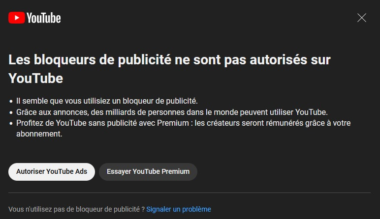
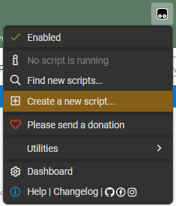
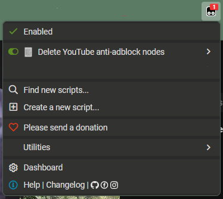

# Remove Stupid YouTube Anti-AdBlocker Popup
## Introduction
I wanted to remove this YouTube anti-adblocker popup, because I don't like it.

So I wrote a basic Tampermonkey script that removes it whenever it appears.

## Installation
### Tampermonkey
First off, you need to install the Tampermonkey add-on to your browser :
- [**Firefox**](https://addons.mozilla.org/fr/firefox/addon/tampermonkey/)
- [**Chrome**](https://chrome.google.com/webstore/detail/tampermonkey/dhdgffkkebhmkfjojejmpbldmpobfkfo)
- [**Edge**](https://microsoftedge.microsoft.com/addons/detail/tampermonkey/iikmkjmpaadaobahmlepeloendndfphd)

### Access the script menu

### Paste the script
Into the editor, paste the script located [in this repo](https://github.com/IncroyablePix/remove-stupid-youtube-anti-adblocker-popup/blob/master/remove-anti-adblocker-popup.js).

After it was pasted, hit **CTRL + S** in order to save the script into Tampermonkey.

### Make sure the script is enabled

That's it!
